# Glitch

Glitch is a local-first focus tracker built around calm, single-task momentum.

This README is based on a full visual audit of the current media set:
- `screenshots/` (13 screen captures)
- `mockup/` (52 device mockups, 4 angles per screen)

## Visual Product Summary

From the reviewed images, the current product experience is:
- A 4-tab structure: `Focus`, `Lists`, `Done`, `Settings`
- Dark-first UI with a high-contrast mint accent
- Single-card focus workflow with timer controls (`Start focus`, `Pause`, `Mark complete`)
- Lightweight planning and reflection loops (`Perfect day complete`, `Plan tomorrow`)
- Lists hub segmented into `Chores`, `Habits`, and `Projects`
- Settings-centric support actions (GitHub link, updates link, Buy Me a Coffee + QR)

## Screen-By-Screen Review

| ID | What the Screen Shows | Screenshot | Mockups |
|---|---|---|---|
| `1000307672` | App launch icon handoff (brand glyph on neutral tile) | 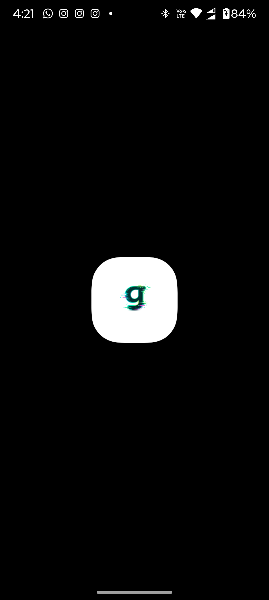 | [portrait](mockup/1000307672-portrait.png) · [landscape](mockup/1000307672-landscape.png) · [left](mockup/1000307672-left.png) · [right](mockup/1000307672-right.png) |
| `1000307673` | Splash screen (`glitch` wordmark + `single-focus day tracking`) | 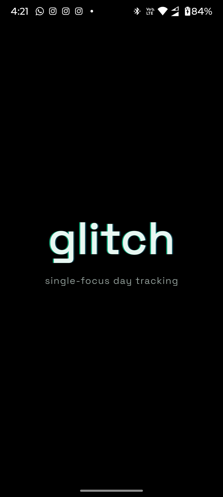 | [portrait](mockup/1000307673-portrait.png) · [landscape](mockup/1000307673-landscape.png) · [left](mockup/1000307673-left.png) · [right](mockup/1000307673-right.png) |
| `1000307674` | Focus empty state (`No tasks for today`, create CTA) | 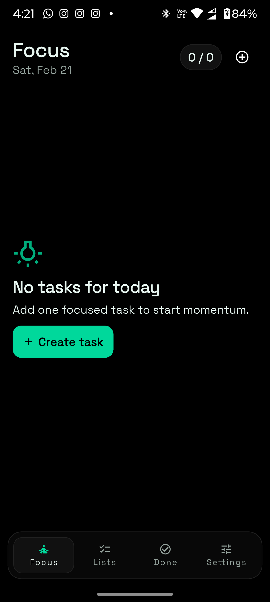 | [portrait](mockup/1000307674-portrait.png) · [landscape](mockup/1000307674-landscape.png) · [left](mockup/1000307674-left.png) · [right](mockup/1000307674-right.png) |
| `1000307675` | Lists tab on `Chores`, empty-state messaging | 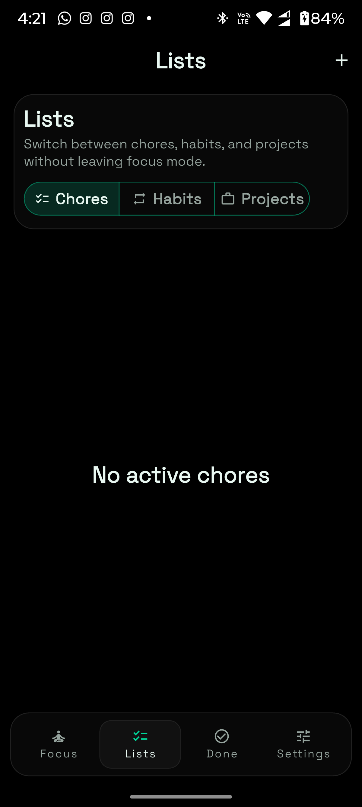 | [portrait](mockup/1000307675-portrait.png) · [landscape](mockup/1000307675-landscape.png) · [left](mockup/1000307675-left.png) · [right](mockup/1000307675-right.png) |
| `1000307676` | Done tab with neutral heatmap and weekly reflection | 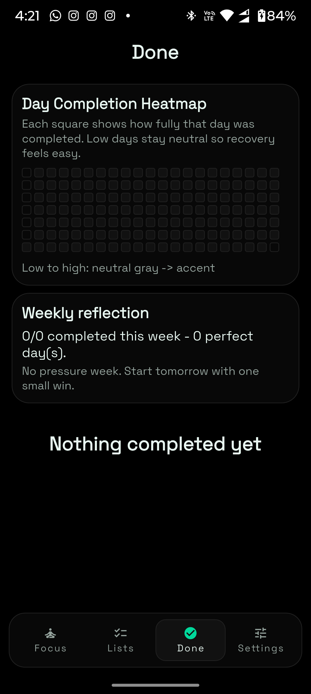 | [portrait](mockup/1000307676-portrait.png) · [landscape](mockup/1000307676-landscape.png) · [left](mockup/1000307676-left.png) · [right](mockup/1000307676-right.png) |
| `1000307677` | Settings (dark mode): appearance, reminders, backup vault controls | 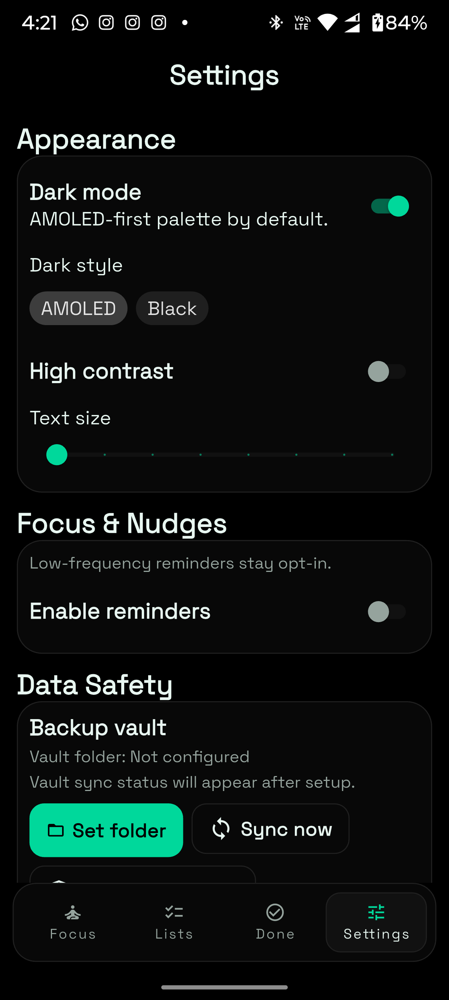 | [portrait](mockup/1000307677-portrait.png) · [landscape](mockup/1000307677-landscape.png) · [left](mockup/1000307677-left.png) · [right](mockup/1000307677-right.png) |
| `1000307678` | Add Task sheet: type/date/effort/energy/description inputs | 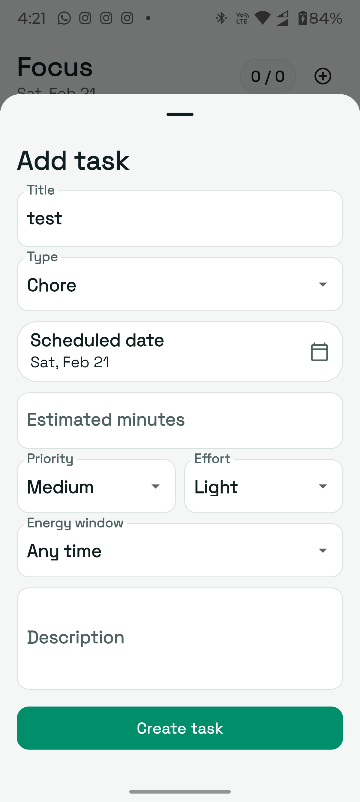 | [portrait](mockup/1000307678-portrait.png) · [landscape](mockup/1000307678-landscape.png) · [left](mockup/1000307678-left.png) · [right](mockup/1000307678-right.png) |
| `1000307679` | Focus card state (paused timer, start + complete actions) | 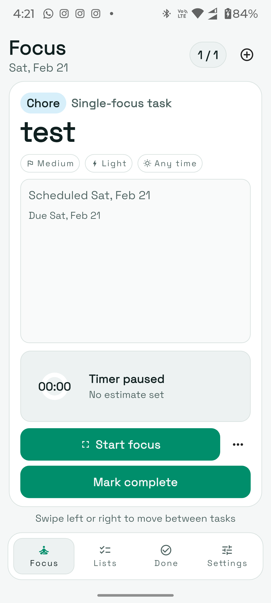 | [portrait](mockup/1000307679-portrait.png) · [landscape](mockup/1000307679-landscape.png) · [left](mockup/1000307679-left.png) · [right](mockup/1000307679-right.png) |
| `1000307680` | Focus run full-screen state (timer running, pause + complete) | 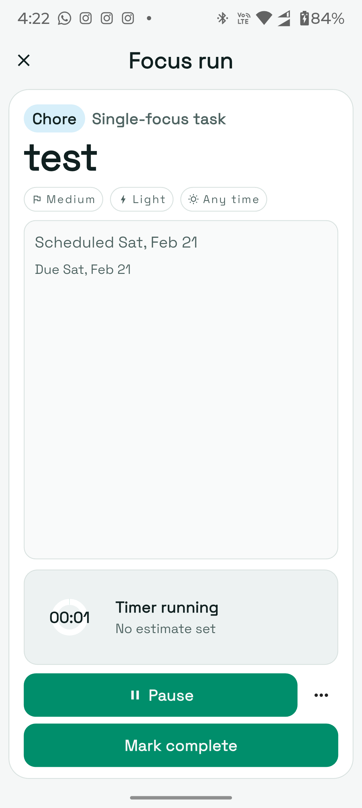 | [portrait](mockup/1000307680-portrait.png) · [landscape](mockup/1000307680-landscape.png) · [left](mockup/1000307680-left.png) · [right](mockup/1000307680-right.png) |
| `1000307681` | Data safety modal: backup-vault setup prompt | 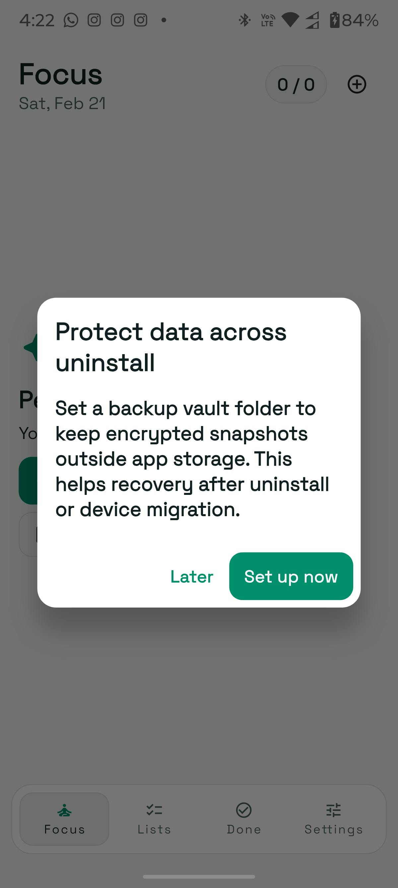 | [portrait](mockup/1000307681-portrait.png) · [landscape](mockup/1000307681-landscape.png) · [left](mockup/1000307681-left.png) · [right](mockup/1000307681-right.png) |
| `1000307682` | Positive completion loop (`Perfect day complete`, plan tomorrow CTA) | 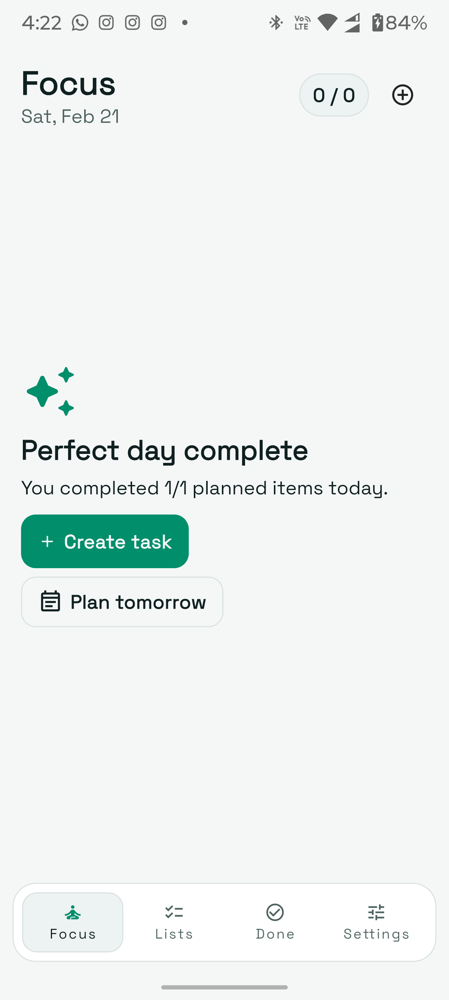 | [portrait](mockup/1000307682-portrait.png) · [landscape](mockup/1000307682-landscape.png) · [left](mockup/1000307682-left.png) · [right](mockup/1000307682-right.png) |
| `1000307683` | Lists tab on `Projects`, milestones-first empty state | 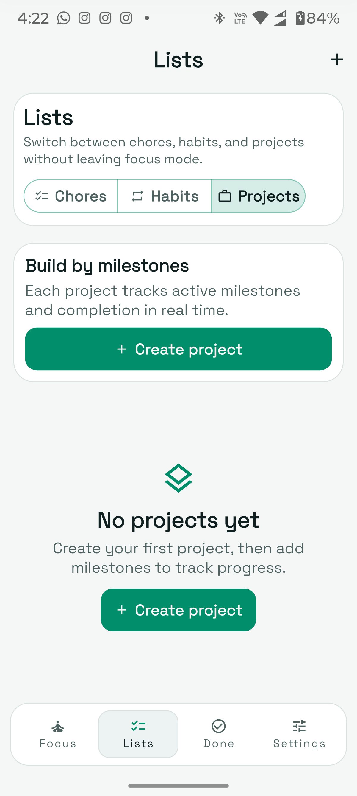 | [portrait](mockup/1000307683-portrait.png) · [landscape](mockup/1000307683-landscape.png) · [left](mockup/1000307683-left.png) · [right](mockup/1000307683-right.png) |
| `1000307684` | Settings (light mode): About/Support links and QR support card | 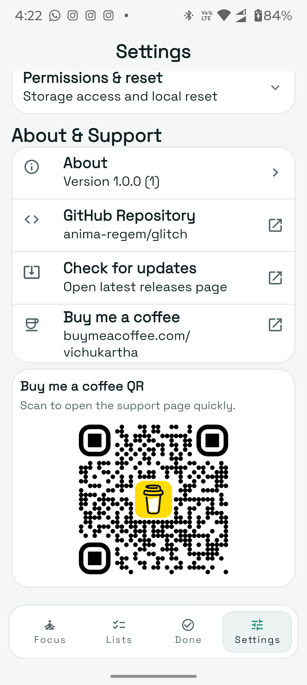 | [portrait](mockup/1000307684-portrait.png) · [landscape](mockup/1000307684-landscape.png) · [left](mockup/1000307684-left.png) · [right](mockup/1000307684-right.png) |

## Mockup Naming Convention

Every screenshot ID has 4 presentation mockups in `mockup/`:
- `-portrait`: flat in-device portrait render
- `-landscape`: rotated landscape render
- `-left`: angled left perspective
- `-right`: angled right perspective

Example set for `1000307679`:
- `mockup/1000307679-portrait.png`
- `mockup/1000307679-landscape.png`
- `mockup/1000307679-left.png`
- `mockup/1000307679-right.png`

## Design Notes From the Audit

- Visual language is consistent: neutral backgrounds, mint accent, rounded containers.
- Focus workflow is clear and action-oriented with stable primary CTA hierarchy.
- Empty states are explicit and low-pressure.
- Support/distribution surfaces are integrated directly in Settings.
- Dark and light representations are both present in the media set.

## Run Locally

```bash
flutter pub get
flutter run
```

## Quality Checks

```bash
flutter analyze
flutter test
```

## Release Flow

See [RELEASE.md](RELEASE.md) for tagging and release workflow details.
