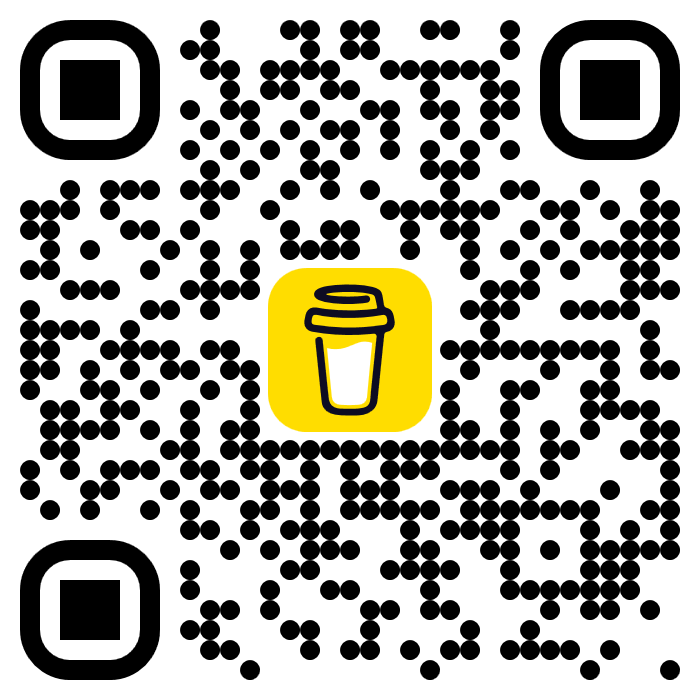

<div align="center">
  

  <p>
    <a href="https://play.google.com/store/apps/details?id=in.karthav.glitch">
      
    </a>
    <a href="https://buymeacoffee.com/vichukartha">
      
    </a>
  </p>

  <h1>Glitch</h1>
  <p>Local-first, single-focus day tracker for calm, consistent execution.</p>
</div>

## Product Overview
Glitch helps people plan less, do more, and recover quickly on low-energy days. It is built for users who want daily momentum without noisy dashboards, aggressive gamification, or account-heavy workflows.

## What You Use It For
- Running focused daily sessions on one task at a time.
- Managing chores, habits, and project work in one lightweight app.
- Tracking completion history with reflective, non-punitive feedback.
- Planning tomorrow with minimal friction at the end of the day.

## Core Features
- **Focus tab**
  - Single-task card flow with clear `Start focus`, `Pause`, and `Mark complete` actions.
  - Dedicated run mode with timer continuity.
  - Daily completion state with a fast path to create the next task.
- **Lists tab**
  - Unified task organization across `Chores`, `Habits`, and `Projects`.
  - Quick-create and edit workflows for each list type.
- **Done tab**
  - Completion heatmap for daily consistency visibility.
  - Weekly reflection summary with recovery-first tone.
- **Settings tab**
  - Appearance controls (theme, contrast, text scaling).
  - Reminder controls (opt-in behavior).
  - Backup vault setup, sync controls, and restore access.
  - About, repository, release checks, and support links.
- **Local-first architecture**
  - Data remains on-device by default.
  - Encrypted backup and restore workflow for portability.

## Why Glitch
- Calm interaction model focused on execution, not pressure.
- Low-clutter information architecture for faster decision-making.
- Recovery-friendly UX for sustainable long-term usage.

## Screenshots
| Focus | Focus Run | Settings |
|---|---|---|
|  |  |  |

## Install & Run
```bash
flutter pub get
flutter run
```

## Quality Checks
```bash
flutter analyze
flutter test
```

## Data & Privacy
- Glitch is local-first and does not require cloud accounts for core use.
- Backup exports are encrypted and designed for restore across devices when using the same passphrase.

## Support
- Buy me a coffee: [buymeacoffee.com/vichukartha](https://buymeacoffee.com/vichukartha)



## Project Links
- GitHub repository: [anima-regem/glitch](https://github.com/anima-regem/glitch)
- Latest releases: [GitHub Releases](https://github.com/anima-regem/glitch/releases/latest)
- Google Play listing: [Glitch on Google Play](https://play.google.com/store/apps/details?id=in.karthav.glitch)
- Privacy policy: [privacy-policy.html](privacy-policy.html)

## Release Process
- Release workflow guide: [RELEASE.md](RELEASE.md)
